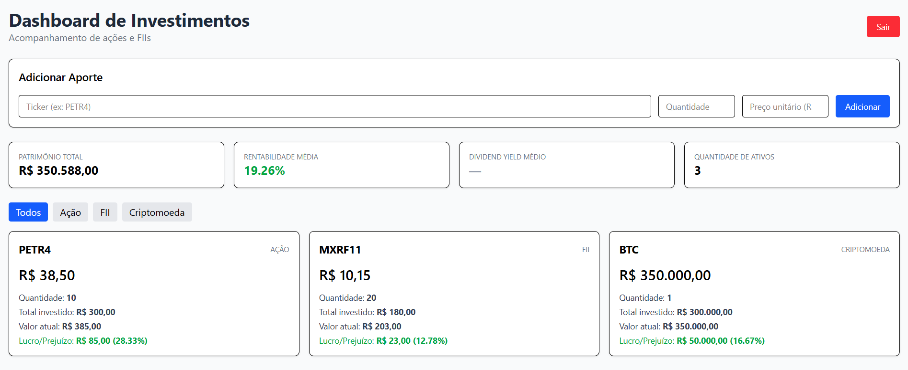

# Dashboard de Investimentos

Interface web para acompanhamento de carteira de investimentos pessoais, desenvolvida em React. Consome a [Investimentos API](https://github.com/EnzoFSouza/investimentos-api) e permite visualizar posições em ações, FIIs e criptomoedas, registrar aportes e acompanhar rentabilidade em tempo real.

🔗 **[Acessar o dashboard](https://dashboard-acoes-react.vercel.app)**



## Funcionalidades

- **Autenticação completa** — cadastro, login e logout com JWT armazenado em cookie `httpOnly`
- **Resumo da carteira** — patrimônio total, rentabilidade média e quantidade de ativos calculados a partir de dados reais do banco
- **Cards individuais** — preço atual, quantidade, total investido, valor atual e lucro/prejuízo por ativo
- **Filtro por tipo** — alternância dinâmica entre Todos, Ação, FII e Criptomoeda
- **Registro de aportes** — formulário para adicionar posições em ativos cadastrados na API
- **Proteção de rotas** — redirecionamento automático para login quando não autenticado
- **Tratamento de erros** — feedback visual para ativo inexistente, campos inválidos e erros de conexão

## Stack

- **React 19** com **Vite**
- **Tailwind CSS 4**
- **React Router DOM** — roteamento entre páginas

## Conceitos de React aplicados

- Componentização com separação clara de responsabilidades
- Gerenciamento de estado com `useState`
- Efeitos colaterais e comunicação com API via `useEffect` e `fetch`
- Roteamento com `BrowserRouter`, `Routes`, `Route` e `Navigate`
- Navegação programática com `useNavigate`
- Formulários controlados — inputs gerenciados por estado
- Manipulação funcional de arrays: `.filter()`, `.map()`, `.reduce()`
- Comunicação filho → pai via funções passadas como props

## Arquitetura

Este repositório é exclusivamente frontend. Toda a lógica de negócio, autenticação e persistência está na [Investimentos API](https://github.com/EnzoFSouza/investimentos-api).

```
Dashboard React (Vercel)
    ↓ HTTPS + cookie httpOnly (sameSite: none)
Investimentos API (Render)
    ↓
SQLite
```

A separação em repositórios independentes permite que múltiplos frontends consumam a mesma API — atualmente também existe uma versão em HTML/CSS/JS puro consumindo as mesmas rotas.

## Como executar localmente

**Pré-requisito:** a [Investimentos API](https://github.com/EnzoFSouza/investimentos-api) precisa estar rodando em `http://localhost:3000`.

```bash
npm install
npm run dev
```

O projeto estará disponível em `http://localhost:5173`.

## Estrutura do projeto

```
src/
├── pages/
│   ├── Login.jsx           ← autenticação
│   ├── Registro.jsx        ← cadastro de novo usuário
│   └── Dashboard.jsx       ← página principal protegida
├── components/
│   ├── Header.jsx          ← título e botão de logout
│   ├── ResumoCarteira.jsx  ← métricas consolidadas
│   ├── ListaAtivos.jsx     ← filtro e grid de ativos
│   ├── CardAtivo.jsx       ← card individual por ativo
│   └── FormularioAtivo.jsx ← registro de aportes
├── config.js               ← URL da API por ambiente
└── App.jsx                 ← roteador principal
```

## Variáveis de ambiente

| Variável | Descrição |
|----------|-----------|
| `VITE_API_URL` | URL base da API (ex: `http://localhost:3000`) |

Crie um `.env.development` localmente com:
```
VITE_API_URL=http://localhost:3000
```

Em produção, a variável é configurada diretamente no painel da Vercel.

## Próximos passos

- Integração com scraper Python para atualização automática de preços via API
- Histórico de aportes por ativo
- Gráfico de evolução do patrimônio
- Página de perfil do usuário