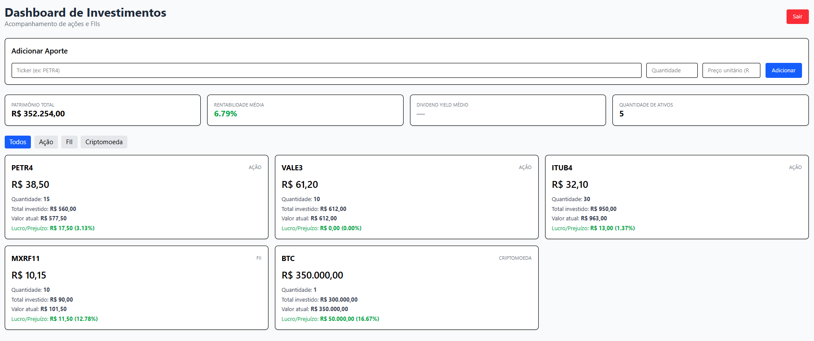

# Dashboard de Investimentos

Interface web para acompanhamento de carteira de investimentos pessoais, desenvolvida em React. Consome a [Investimentos API](https://github.com/EnzoFSouza/investimentos-api) e permite visualizar posições em ações, FIIs e criptomoedas, registrar aportes e acompanhar rentabilidade.



## Funcionalidades

- **Autenticação** — login e logout com JWT armazenado em cookie `httpOnly`
- **Resumo da carteira** — patrimônio total, rentabilidade média e quantidade de ativos, calculados a partir dos dados armazenados em banco de dados
- **Cards individuais** — preço atual, quantidade, total investido, valor atual e lucro/prejuízo por ativo
- **Filtro por tipo** — alternância entre Todos, Ação, FII e Criptomoeda
- **Registro de aportes** — formulário para adicionar posições em ativos cadastrados na API
- **Proteção de rotas** — redirecionamento automático para login quando não autenticado

## Stack

- **React 19** — biblioteca para construção da interface
- **Vite** — build tool e servidor de desenvolvimento
- **Tailwind CSS 4** — estilização utility-first
- **React Router DOM** — roteamento entre páginas (login e dashboard)

## Conceitos aplicados

- Componentização (`Header`, `ResumoCarteira`, `ListaAtivos`, `CardAtivo`, `FormularioAtivo`)
- Gerenciamento de estado com `useState`
- Comunicação com API externa via `useEffect` e `fetch` com `credentials: "include"`
- Roteamento com `BrowserRouter`, `Routes`, `Route` e `Navigate`
- Navegação programática com `useNavigate`
- Formulários controlados (inputs gerenciados por estado)
- Manipulação de arrays: `.filter()`, `.map()`, `.reduce()`

## Arquitetura

Este projeto é exclusivamente frontend — toda a lógica de negócio, autenticação e persistência de dados está na [Investimentos API](https://github.com/EnzoFSouza/investimentos-api), desenvolvida em Node.js/Express com SQLite.

```
dashboard-react/          ← este repositório (frontend)
investimentos-api/        ← repositório separado (backend)
```

## Como executar

**Pré-requisito:** a [Investimentos API](https://github.com/EnzoFSouza/investimentos-api) precisa estar rodando em `http://localhost:3000`.

**1. Instalar dependências:**
```bash
npm install
```

**2. Iniciar o servidor de desenvolvimento:**
```bash
npm run dev
```

O projeto estará disponível em `http://localhost:5173`.

## Estrutura do projeto

```
src/
├── pages/
│   ├── Login.jsx         ← formulário de autenticação
│   └── Dashboard.jsx     ← página principal protegida
├── components/
│   ├── Header.jsx        ← título e botão de logout
│   ├── ResumoCarteira.jsx ← métricas consolidadas da carteira
│   ├── ListaAtivos.jsx   ← filtro e grid de ativos
│   ├── CardAtivo.jsx     ← card individual de cada ativo
│   └── FormularioAtivo.jsx ← registro de novos aportes
└── App.jsx               ← roteador principal
```

## Backend relacionado

Este frontend consome a **Investimentos API**: um backend REST desenvolvido em Node.js com Express e SQLite, que centraliza autenticação, persistência e cálculos financeiros para múltiplos frontends.

Repositório: [investimentos-api](https://github.com/EnzoFSouza/investimentos-api)

## Próximos passos

- Deploy na Vercel
- Página de registro de novos usuários
- Integração com scraper Python para atualização automática de preços
- Histórico de aportes por ativo
- Gráfico de evolução do patrimônio